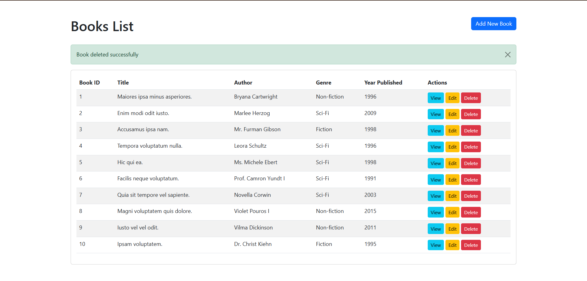

# Book Management System

This project is a conversion of the Student Management CRUD system into a **Book Management System** for my Midterm Project.

## Project Details

- **Management System Name:** Book Management System
- **Entity:** Book
- **Framework:** Laravel

## Database Table Fields

The `books` table contains the following fields used for managing the library records:
* **id**: Primary Key (Auto-increment)
* **title**: The title of the book
* **author**: The author of the book
* **genre**: The book category (e.g., Fiction, Non-Fiction, Mystery)
* **year_published**: The year the book was released
* **created_at**: Timestamp for record creation
* **updated_at**: Timestamp for last record update

## Features


- **Create**: Allows adding new book records with validation for all required fields.
- **Read**: Displays a paginated list of all books and allows viewing specific book details.
- **Update**: Provides the ability to edit existing book information.
- **Delete**: Allows removing book records from the database.

### 📸 Application Interface



## Setup Instructions

1. **Clone the repository:**
   ```bash
   git clone [(https://github.com/liLyxws/book-management-system.git)]