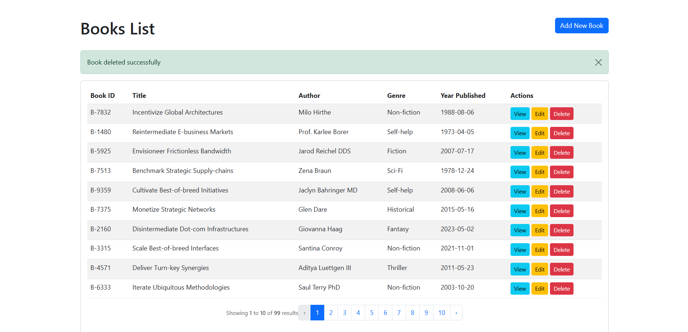
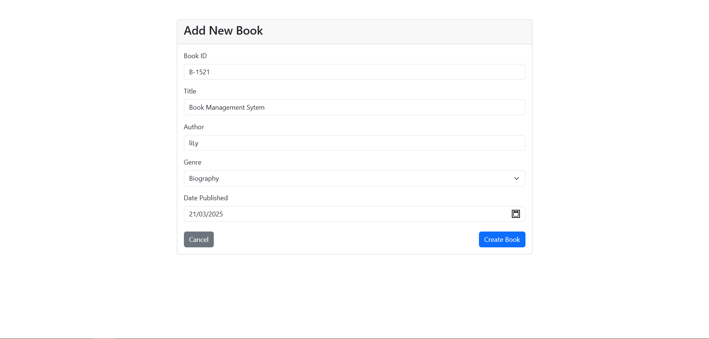
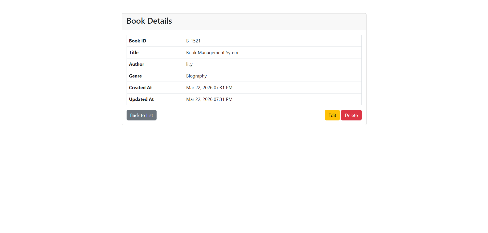
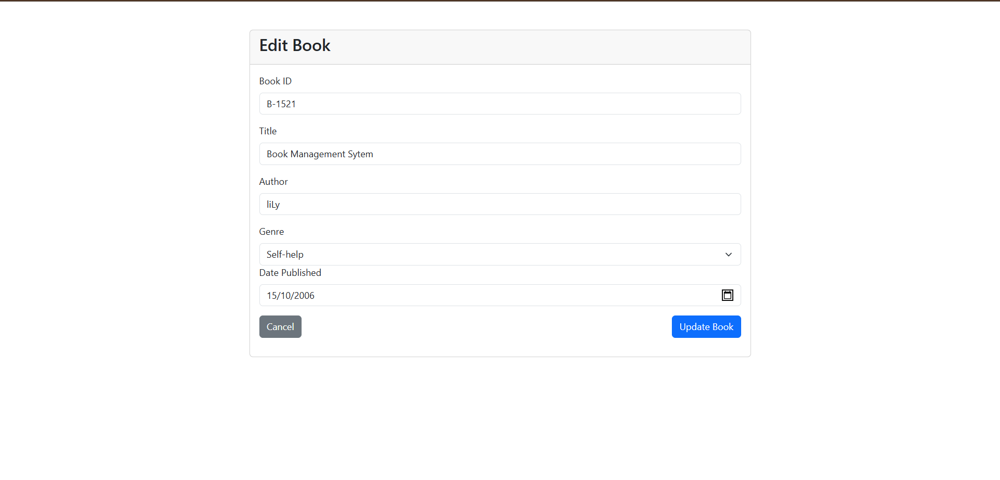

# 📚 Book Management System

This project is a conversion of a Student Management CRUD system into a **Book Management System**, developed as a Midterm Project. It features a complete CRUD (Create, Read, Update, Delete) functionality for managing library records using the Laravel framework.

## 🚀 Project Details

- **Management System Name:** Book Management System
- **Entity:** Book
- **Framework:** Laravel 12.x
- **PHP Version:** 8.2.x

---

## 🛠 Features

- **Create**: Allows adding new book records with validation and a Date Picker for publication dates.
- **Read**: Displays a paginated list of all books and allows viewing specific book details.
- **Update**: Provides the ability to edit existing book information with a "Read-only" Book ID protection.
- **Delete**: Allows safe removal of book records from the database.

---

## 🗄 Database Table Fields

The `books` table contains the following fields:

| Field | Description |
| :--- | :--- |
| **book_id** | Unique Identifier (e.g., B-1001) |
| **title** | The title of the book |
| **author** | The author of the book |
| **genre** | Category (Fiction, Non-Fiction, Mystery, etc.) |
| **year_published** | Date of publication (Stored as YYYY-MM-DD) |
| **created_at** | Timestamp for record creation |
| **updated_at** | Timestamp for last record update |

---

## 📸 Application Interface

### 🖥️ Main Dashboard (Book List)


### ➕ Add New Book


### 🔍 View Book Details


### ✏️ Edit Book Information


---

## ⚙️ Setup Instructions

1. **Clone the repository:**
   ```bash
   git clone [https://github.com/liLyxws/book-management-system.git](https://github.com/liLyxws/book-management-system.git)